# Smart Vault – EBS Snapshot Automation

> Terraform · AWS · Lambda · EventBridge · SNS · CloudWatch

## Overview
Smart Vault is a serverless, infrastructure-as-code solution that automates EBS snapshot creation and cleanup using **AWS Lambda**, **Amazon EventBridge**, **SNS**, and **CloudWatch**, all deployed entirely through **Terraform**. This project showcases modular design, automated scheduling, error alerting, and snapshot retention logic with no manual intervention required.

---

## Demo

🎥 **Watch the full demo on YouTube**  

> This walkthrough shows the entire setup and behavior of Smart Vault — including snapshot creation, cleanup, notifications, and scheduling via Terraform.

📦 This service is currently turned off to reduce AWS costs, but everything in the demo is fully reproducible from this repo.

---

## Architecture
This diagram summarizes the full AWS-powered design of Smart Vault:

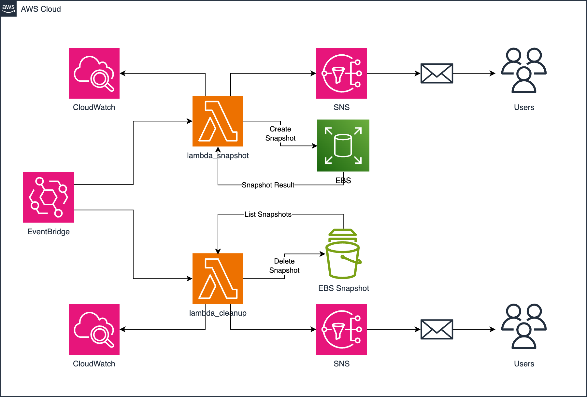

- **Lambda Functions** create and clean up EBS snapshots
- **EventBridge Rules** schedule daily snapshot + cleanup
- **SNS** sends success/failure alerts to email
- **CloudWatch Logs** monitor function execution and errors

---

## How It Works
Each step below corresponds with a real screenshot inside the `screenshots/` folder.

### 1. Project Structure & Terraform Backend
- `backend.tf` stores Terraform state in S3 + DynamoDB
- Modular setup inside `modules/`

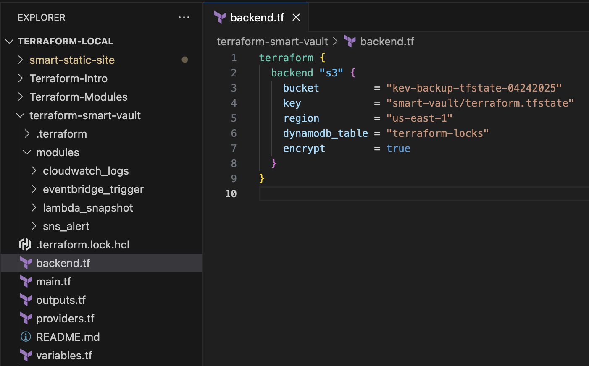
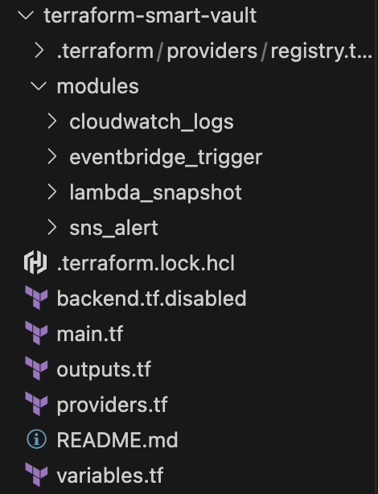

### 2. Create Backend Resources
- Provision backend S3 + DynamoDB with Terraform

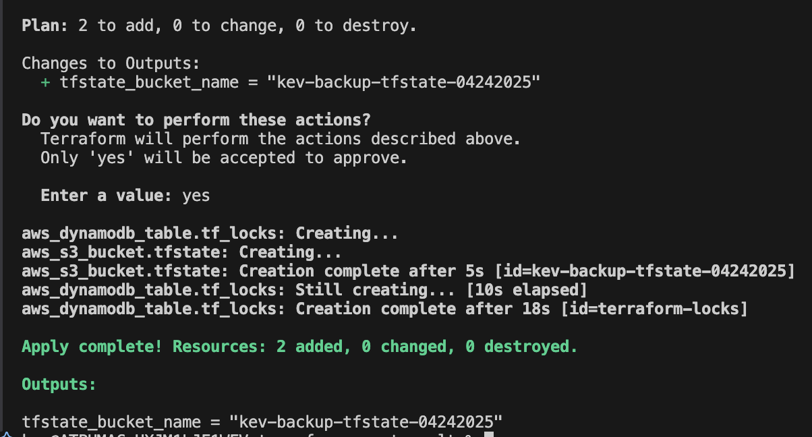

### 3. Reconfigure Local State to Remote
- Initialize the new backend after enabling the `backend.tf`

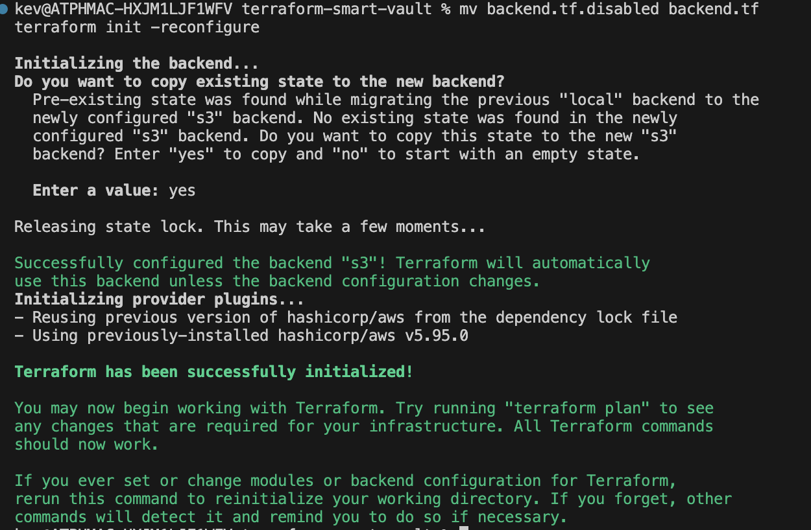

### 4. Deploy Snapshot Lambda + IAM Role
- Uses module `lambda_snapshot`

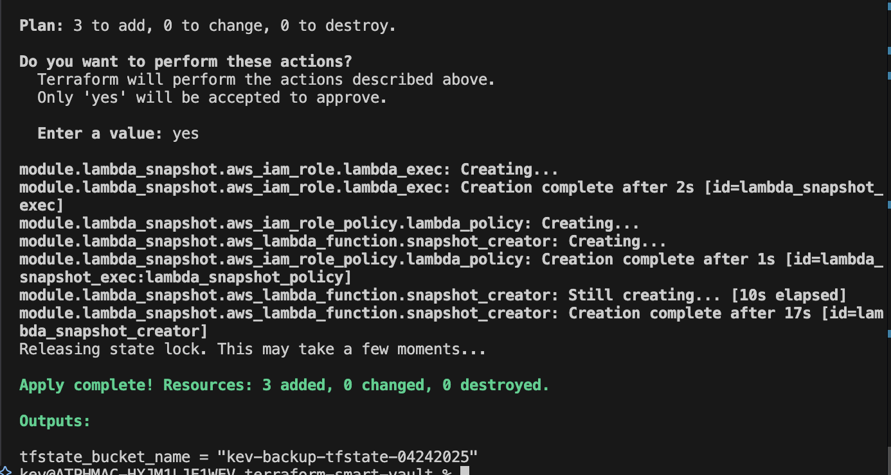

### 5. Create EventBridge Rule (Daily Trigger)
- Triggers snapshot Lambda once per day

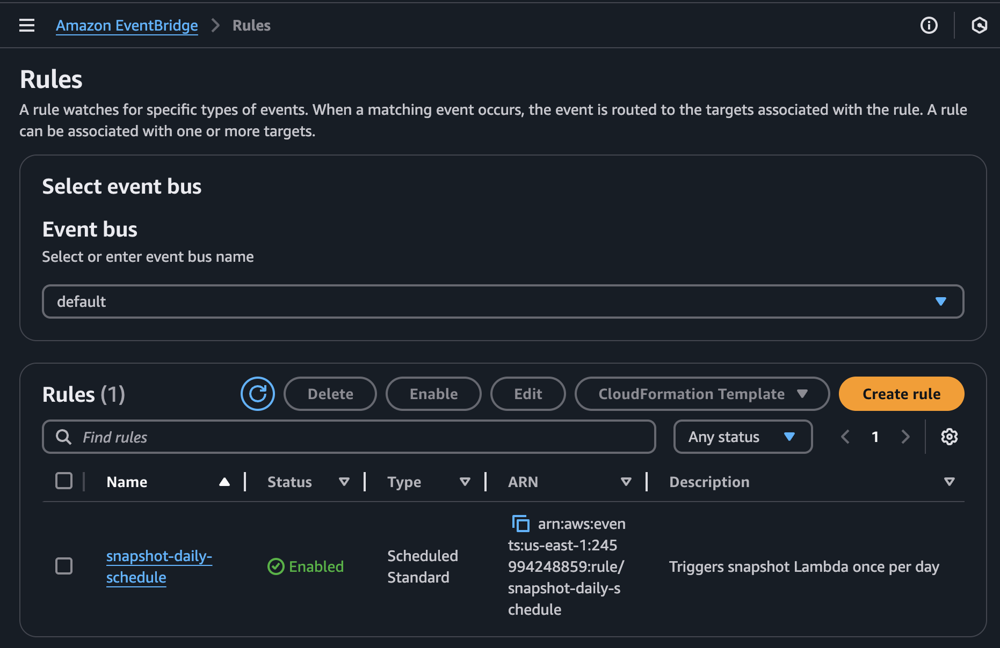
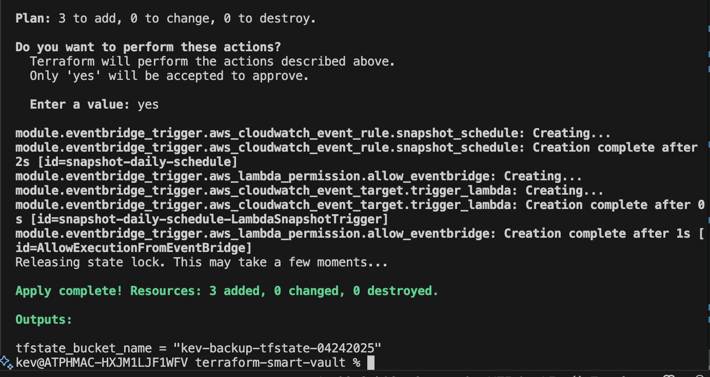

### 6. Test Snapshot Function
- Python code filters for `tag:Backup = True`

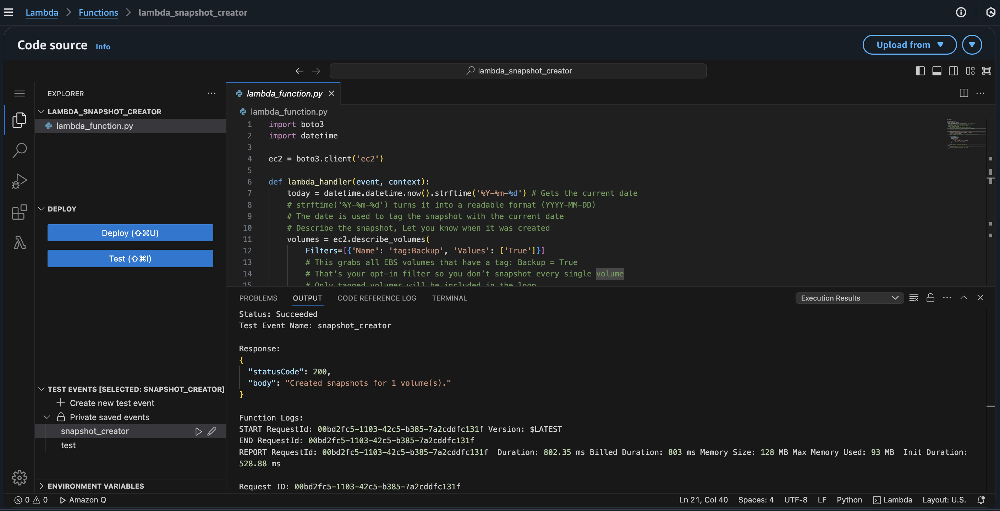
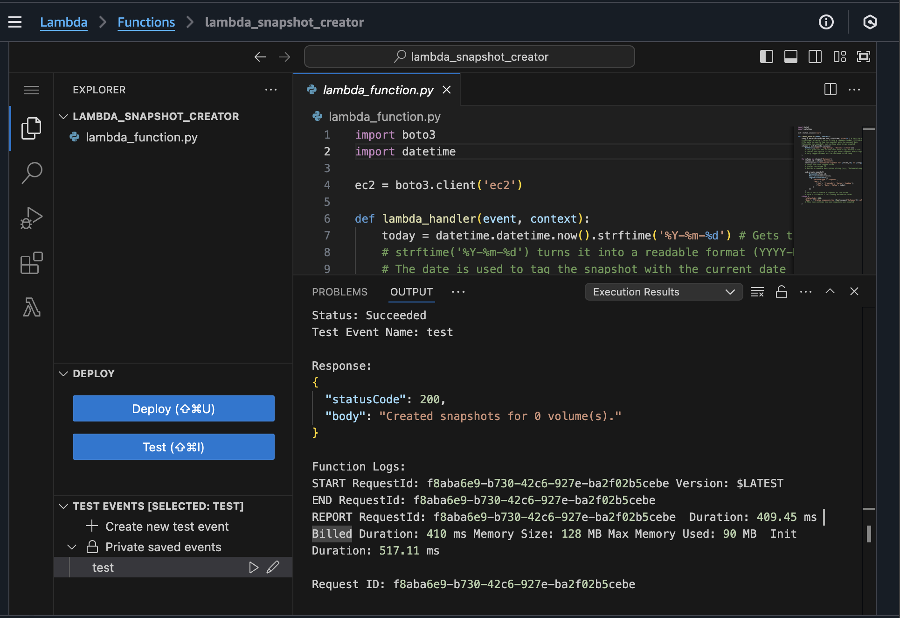

### 7. Enable CloudWatch Logging
- Log group auto-created and tracked in Terraform

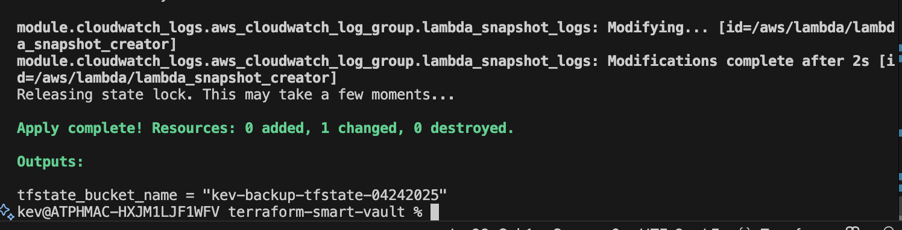

### 8. Add SNS Alerts
- Sends snapshot result/failure emails to user

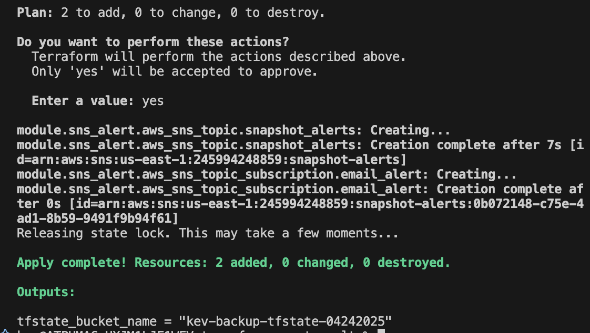
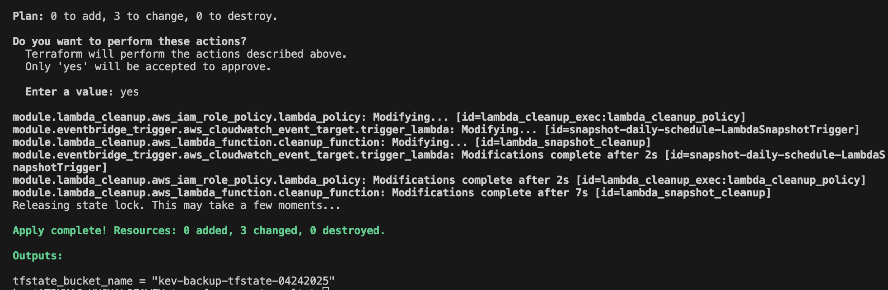

### 9. Deploy Cleanup Lambda
- Deletes snapshots older than 7 days

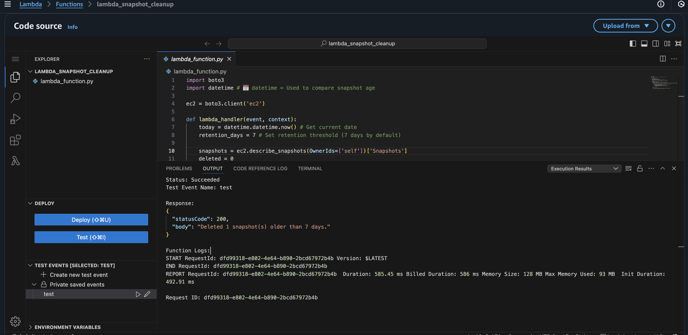
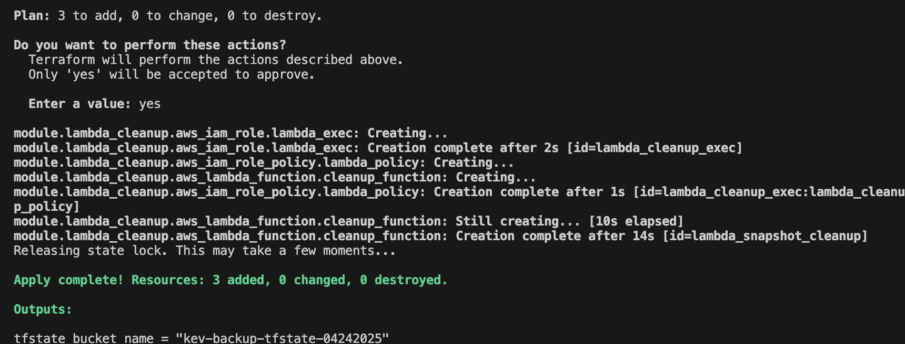

### 10. Schedule Cleanup with EventBridge
- Daily cleanup trigger added via `eventbridge_cleanup_trigger`

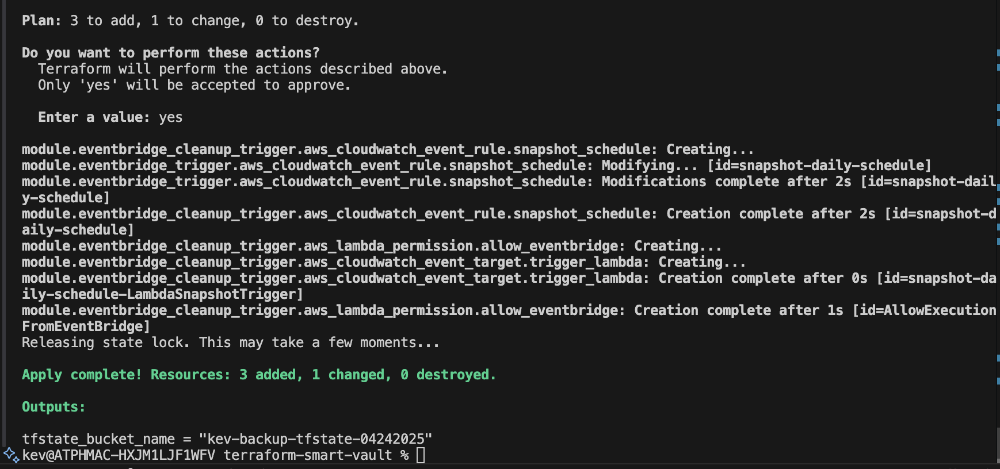

### 11. Modify or Redeploy Modules
- Example apply with changes

---

## Modules Used
All reusable modules are stored in the `modules/` folder:

- `lambda_snapshot` - Creates EBS snapshots tagged with the current date
- `lambda_cleanup` - Deletes EBS snapshots older than retention threshold
- `eventbridge_trigger` - Triggers Lambda functions on schedule
- `cloudwatch_logs` - Manages log group for each Lambda
- `sns_alert` - Configures SNS topic + email alert subscription

---

## What I Learned
- 📅 How to automate snapshots using EventBridge without manual triggers
- 💬 How to send real-time failure alerts with SNS
- 🧼 How to build logic that filters and deletes only old snapshots
- ⚙️ How to modularize Terraform projects and keep code clean
- 💡 Keeping logging optional helps reduce clutter and cost

**Next time:** I may add snapshot encryption, SSM parameterization, or CloudTrail tracking for audit compliance.

---

Built with ❤️ using Terraform and AWS.